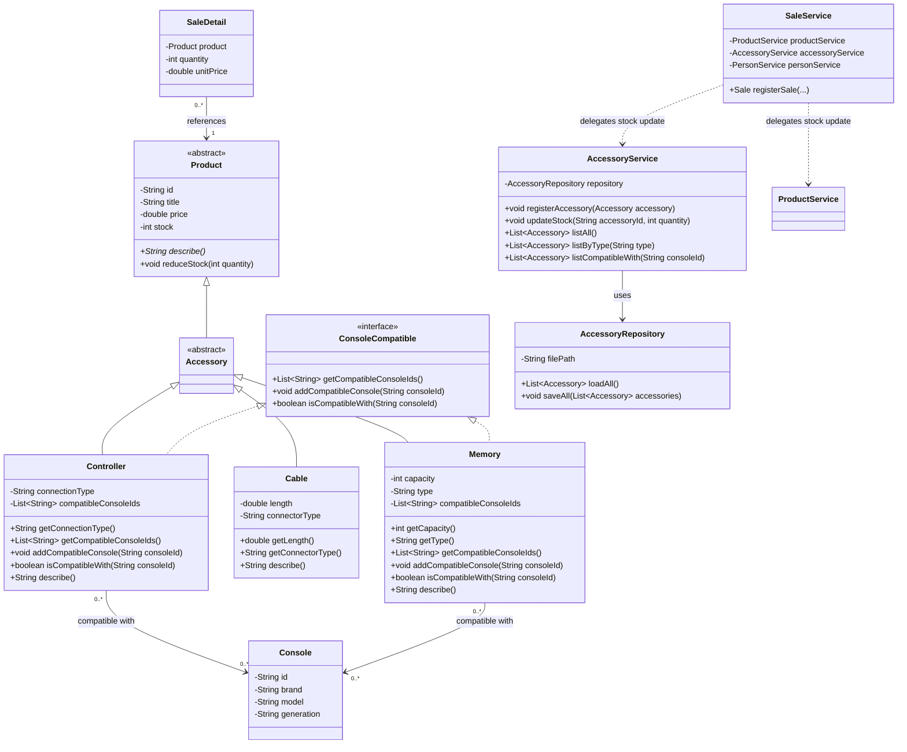

# Class Diagram — Accessory Module

```mermaid
classDiagram
    class Product {
        <<abstract>>
        -String id
        -String title
        -double price
        -int stock
        +String describe()*
        +void reduceStock(int quantity)
    }

    class Accessory {
        <<abstract>>
    }

    class ConsoleCompatible {
        <<interface>>
        +List~String~ getCompatibleConsoleIds()
        +void addCompatibleConsole(String consoleId)
        +boolean isCompatibleWith(String consoleId)
    }

    class Controller {
        -String connectionType
        -List~String~ compatibleConsoleIds
        +String getConnectionType()
        +List~String~ getCompatibleConsoleIds()
        +void addCompatibleConsole(String consoleId)
        +boolean isCompatibleWith(String consoleId)
        +String describe()
    }

    class Cable {
        -double length
        -String connectorType
        +double getLength()
        +String getConnectorType()
        +String describe()
    }

    class Memory {
        -int capacity
        -String type
        -List~String~ compatibleConsoleIds
        +int getCapacity()
        +String getType()
        +List~String~ getCompatibleConsoleIds()
        +void addCompatibleConsole(String consoleId)
        +boolean isCompatibleWith(String consoleId)
        +String describe()
    }

    class Console {
        -String id
        -String brand
        -String model
        -String generation
    }

    class SaleDetail {
        -Product product
        -int quantity
        -double unitPrice
    }

    class SaleService {
        -ProductService productService
        -AccessoryService accessoryService
        -PersonService personService
        +Sale registerSale(...)
    }

    class AccessoryRepository {
        -String filePath
        +List~Accessory~ loadAll()
        +void saveAll(List~Accessory~ accessories)
    }

    class AccessoryService {
        -AccessoryRepository repository
        +void registerAccessory(Accessory accessory)
        +void updateStock(String accessoryId, int quantity)
        +List~Accessory~ listAll()
        +List~Accessory~ listByType(String type)
        +List~Accessory~ listCompatibleWith(String consoleId)
    }

    Product <|-- Accessory
    Accessory <|-- Controller
    Accessory <|-- Cable
    Accessory <|-- Memory

    ConsoleCompatible <|.. Controller
    ConsoleCompatible <|.. Memory

    SaleDetail "0..*" --> "1" Product : references
    SaleService ..> AccessoryService : delegates stock update
    SaleService ..> ProductService : delegates stock update
    AccessoryService --> AccessoryRepository : uses
    Controller "0..*" --> "0..*" Console : compatible with
    Memory "0..*" --> "0..*" Console : compatible with
```
