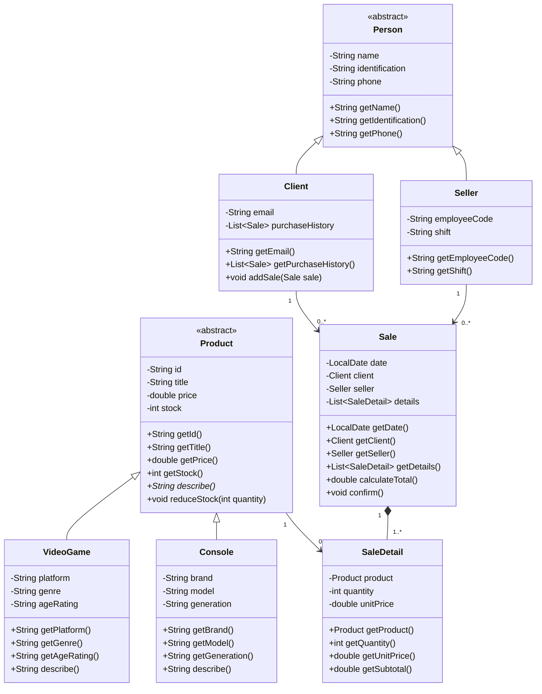

```mermaid
classDiagram
    class Person {
        <<abstract>>
        -String name
        -String identification
        -String phone
        +String getName()
        +String getIdentification()
        +String getPhone()
    }

    class Client {
        -String email
        -List~Sale~ purchaseHistory
        +String getEmail()
        +List~Sale~ getPurchaseHistory()
        +void addSale(Sale sale)
    }

    class Seller {
        -String employeeCode
        -String shift
        +String getEmployeeCode()
        +String getShift()
    }

    class Product {
        <<abstract>>
        -String id
        -String title
        -double price
        -int stock
        +String getId()
        +String getTitle()
        +double getPrice()
        +int getStock()
        +String describe()*
        +void reduceStock(int quantity)
    }

    class VideoGame {
        -String platform
        -String genre
        -String ageRating
        +String getPlatform()
        +String getGenre()
        +String getAgeRating()
        +String describe()
    }

    class Console {
        -String brand
        -String model
        -String generation
        +String getBrand()
        +String getModel()
        +String getGeneration()
        +String describe()
    }

    class Sale {
        -LocalDate date
        -Client client
        -Seller seller
        -List~SaleDetail~ details
        +LocalDate getDate()
        +Client getClient()
        +Seller getSeller()
        +List~SaleDetail~ getDetails()
        +double calculateTotal()
        +void confirm()
    }

    class SaleDetail {
        -Product product
        -int quantity
        -double unitPrice
        +Product getProduct()
        +int getQuantity()
        +double getUnitPrice()
        +double getSubtotal()
    }

    Person <|-- Client
    Person <|-- Seller
    Product <|-- VideoGame
    Product <|-- Console
    Client "1" --> "0..*" Sale
    Seller "1" --> "0..*" Sale
    Product "1" --> "0..*" SaleDetail
    Sale "1" *-- "1..*" SaleDetail
```
