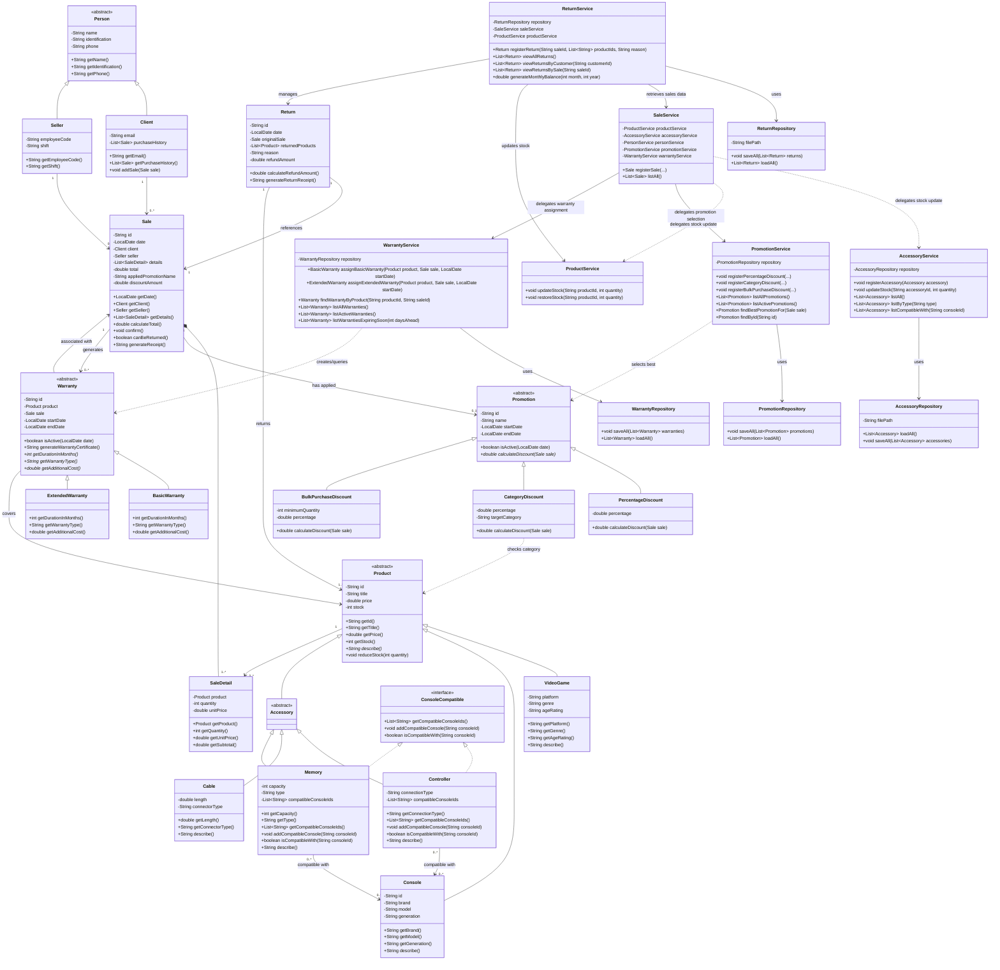

```mermaid
classDiagram
    %% ===== Base: people =====
    class Person {
        <<abstract>>
        -String name
        -String identification
        -String phone
        +String getName()
        +String getIdentification()
        +String getPhone()
    }

    class Client {
        -String email
        -List~Sale~ purchaseHistory
        +String getEmail()
        +List~Sale~ getPurchaseHistory()
        +void addSale(Sale sale)
    }

    class Seller {
        -String employeeCode
        -String shift
        +String getEmployeeCode()
        +String getShift()
    }

    %% ===== Base: products =====
    class Product {
        <<abstract>>
        -String id
        -String title
        -double price
        -int stock
        +String getId()
        +String getTitle()
        +double getPrice()
        +int getStock()
        +String describe()*
        +void reduceStock(int quantity)
    }

    class VideoGame {
        -String platform
        -String genre
        -String ageRating
        +String getPlatform()
        +String getGenre()
        +String getAgeRating()
        +String describe()
    }

    class Console {
        -String id
        -String brand
        -String model
        -String generation
        +String getBrand()
        +String getModel()
        +String getGeneration()
        +String describe()
    }

    %% ===== Requirement 1: accessories =====
    class Accessory {
        <<abstract>>
    }

    class ConsoleCompatible {
        <<interface>>
        +List~String~ getCompatibleConsoleIds()
        +void addCompatibleConsole(String consoleId)
        +boolean isCompatibleWith(String consoleId)
    }

    class Controller {
        -String connectionType
        -List~String~ compatibleConsoleIds
        +String getConnectionType()
        +List~String~ getCompatibleConsoleIds()
        +void addCompatibleConsole(String consoleId)
        +boolean isCompatibleWith(String consoleId)
        +String describe()
    }

    class Cable {
        -double length
        -String connectorType
        +double getLength()
        +String getConnectorType()
        +String describe()
    }

    class Memory {
        -int capacity
        -String type
        -List~String~ compatibleConsoleIds
        +int getCapacity()
        +String getType()
        +List~String~ getCompatibleConsoleIds()
        +void addCompatibleConsole(String consoleId)
        +boolean isCompatibleWith(String consoleId)
        +String describe()
    }

    class AccessoryRepository {
        -String filePath
        +List~Accessory~ loadAll()
        +void saveAll(List~Accessory~ accessories)
    }

    class AccessoryService {
        -AccessoryRepository repository
        +void registerAccessory(Accessory accessory)
        +void updateStock(String accessoryId, int quantity)
        +List~Accessory~ listAll()
        +List~Accessory~ listByType(String type)
        +List~Accessory~ listCompatibleWith(String consoleId)
    }

    %% ===== Requirement 2: promotions =====
    class Promotion {
        <<abstract>>
        -String id
        -String name
        -LocalDate startDate
        -LocalDate endDate
        +boolean isActive(LocalDate date)
        +double calculateDiscount(Sale sale)*
    }

    class PercentageDiscount {
        -double percentage
        +double calculateDiscount(Sale sale)
    }

    class CategoryDiscount {
        -double percentage
        -String targetCategory
        +double calculateDiscount(Sale sale)
    }

    class BulkPurchaseDiscount {
        -int minimumQuantity
        -double percentage
        +double calculateDiscount(Sale sale)
    }

    class PromotionRepository {
        +void saveAll(List~Promotion~ promotions)
        +List~Promotion~ loadAll()
    }

    class PromotionService {
        -PromotionRepository repository
        +void registerPercentageDiscount(...)
        +void registerCategoryDiscount(...)
        +void registerBulkPurchaseDiscount(...)
        +List~Promotion~ listAllPromotions()
        +List~Promotion~ listActivePromotions()
        +Promotion findBestPromotionFor(Sale sale)
        +Promotion findById(String id)
    }

    %% ===== Requirement 4: warranties =====
    class Warranty {
        <<abstract>>
        -String id
        -Product product
        -Sale sale
        -LocalDate startDate
        -LocalDate endDate
        +boolean isActive(LocalDate date)
        +String generateWarrantyCertificate()
        +int getDurationInMonths()*
        +String getWarrantyType()*
        +double getAdditionalCost()*
    }

    class BasicWarranty {
        +int getDurationInMonths()
        +String getWarrantyType()
        +double getAdditionalCost()
    }

    class ExtendedWarranty {
        +int getDurationInMonths()
        +String getWarrantyType()
        +double getAdditionalCost()
    }

    class WarrantyRepository {
        +void saveAll(List~Warranty~ warranties)
        +List~Warranty~ loadAll()
    }

    class WarrantyService {
        -WarrantyRepository repository
        +BasicWarranty assignBasicWarranty(Product product, Sale sale, LocalDate startDate)
        +ExtendedWarranty assignExtendedWarranty(Product product, Sale sale, LocalDate startDate)
        +Warranty findWarrantyByProduct(String productId, String saleId)
        +List~Warranty~ listAllWarranties()
        +List~Warranty~ listActiveWarranties()
        +List~Warranty~ listWarrantiesExpiringSoon(int daysAhead)
    }

    %% ===== Base: sales (extended by requirements 2, 3 and 4) =====
    class Sale {
        -String id
        -LocalDate date
        -Client client
        -Seller seller
        -List~SaleDetail~ details
        -double total
        -String appliedPromotionName
        -double discountAmount
        +LocalDate getDate()
        +Client getClient()
        +Seller getSeller()
        +List~SaleDetail~ getDetails()
        +double calculateTotal()
        +void confirm()
        +boolean canBeReturned()
        +String generateReceipt()
    }

    class SaleDetail {
        -Product product
        -int quantity
        -double unitPrice
        +Product getProduct()
        +int getQuantity()
        +double getUnitPrice()
        +double getSubtotal()
    }

    %% ===== Requirement 3: returns =====
    class Return {
        -String id
        -LocalDate date
        -Sale originalSale
        -List~Product~ returnedProducts
        -String reason
        -double refundAmount
        +double calculateRefundAmount()
        +String generateReturnReceipt()
    }

    class ReturnRepository {
        -String filePath
        +void saveAll(List~Return~ returns)
        +List~Return~ loadAll()
    }

    class ReturnService {
        -ReturnRepository repository
        -SaleService saleService
        -ProductService productService
        +Return registerReturn(String saleId, List~String~ productIds, String reason)
        +List~Return~ viewAllReturns()
        +List~Return~ viewReturnsByCustomer(String customerId)
        +List~Return~ viewReturnsBySale(String saleId)
        +double generateMonthlyBalance(int month, int year)
    }

    %% ===== Services that connect the modules =====
    class ProductService {
        +void updateStock(String productId, int quantity)
        +void restoreStock(String productId, int quantity)
    }

    class SaleService {
        -ProductService productService
        -AccessoryService accessoryService
        -PersonService personService
        -PromotionService promotionService
        -WarrantyService warrantyService
        +Sale registerSale(...)
        +List~Sale~ listAll()
    }

    %% ===== Inheritance and realization =====
    Person <|-- Client
    Person <|-- Seller
    Product <|-- VideoGame
    Product <|-- Console
    Product <|-- Accessory
    Accessory <|-- Controller
    Accessory <|-- Cable
    Accessory <|-- Memory
    ConsoleCompatible <|.. Controller
    ConsoleCompatible <|.. Memory
    Promotion <|-- PercentageDiscount
    Promotion <|-- CategoryDiscount
    Promotion <|-- BulkPurchaseDiscount
    Warranty <|-- BasicWarranty
    Warranty <|-- ExtendedWarranty

    %% ===== Associations in the model =====
    Client "1" --> "0..*" Sale
    Seller "1" --> "0..*" Sale
    Product "1" --> "0..*" SaleDetail
    Sale "1" *-- "1..*" SaleDetail
    Controller "0..*" --> "0..*" Console : compatible with
    Memory "0..*" --> "0..*" Console : compatible with
    Sale "1" --> "0..1" Promotion : has applied
    CategoryDiscount ..> Product : checks category
    Sale "1" --> "0..*" Warranty : generates
    Warranty --> Product : covers
    Warranty --> Sale : associated with
    Return "1" --> "1" Sale : references
    Return "1" --> "1..*" Product : returns

    %% ===== Dependencies between services and repositories =====
    AccessoryService --> AccessoryRepository : uses
    PromotionService --> PromotionRepository : uses
    PromotionService ..> Promotion : selects best
    WarrantyService --> WarrantyRepository : uses
    WarrantyService ..> Warranty : creates/queries
    ReturnService --> ReturnRepository : uses
    ReturnService --> SaleService : retrieves sales data
    ReturnService --> ProductService : updates stock
    ReturnService --> Return : manages
    SaleService ..> AccessoryService : delegates stock update
    SaleService ..> ProductService : delegates stock update
    SaleService --> PromotionService : delegates promotion selection
    SaleService --> WarrantyService : delegates warranty assignment
```