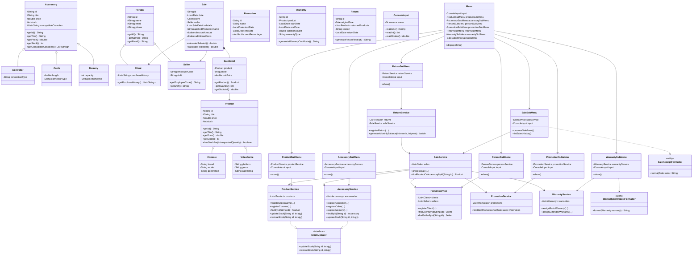

```mermaid
classDiagram
    direction TB

    %% ==========================================
    %% 1. CAPA DE MODELOS / DOMINIO
    %% ==========================================
    class StockUpdater {
        <<interface>>
        +updateStock(String id, int qty)
        +restoreStock(String id, int qty)
    }

    class Product {
        #String id
        #String title
        #double price
        #int stock
        +getId() String
        +getTitle() String
        +getPrice() double
        +getStock() int
        +hasStockFor(int requestedQuantity) boolean
    }

    class Console {
        -String brand
        -String model
        -String generation
    }

    class VideoGame {
        -String platform
        -String genre
        -String ageRating
    }

    Product <|-- Console
    Product <|-- VideoGame

    class Accessory {
        #String id
        #String title
        #double price
        #int stock
        #List~String~ compatibleConsoles
        +getId() String
        +getTitle() String
        +getPrice() double
        +getStock() int
        +getCompatibleConsoles() List~String~
    }

    class Controller {
        -String connectionType
    }

    class Cable {
        -double length
        -String connectorType
    }

    class Memory {
        -int capacity
        -String memoryType
    }

    Accessory <|-- Controller
    Accessory <|-- Cable
    Accessory <|-- Memory

    class Person {
        #String id
        #String name
        #String email
        #String phone
        +getId() String
        +getName() String
        +getEmail() String
    }

    class Client {
        -List~String~ purchaseHistory
        +getPurchaseHistory() List~String~
    }

    class Seller {
        -String employeeCode
        -String shift
        +getEmployeeCode() String
        +getShift() String
    }

    Person <|-- Client
    Person <|-- Seller

    class Sale {
        -String id
        -LocalDate date
        -Client client
        -Seller seller
        -List~SaleDetail~ details
        -String appliedPromotionName
        -double discountAmount
        -double additionalCosts
        +calculateSubtotal() double
        +calculateFinalTotal() double
    }

    class SaleDetail {
        -Product product
        -int quantity
        -double unitPrice
        +getProduct() Product
        +getQuantity() int
        +getSubtotal() double
    }

    Sale *-- SaleDetail
    Sale --> Client
    Sale --> Seller
    SaleDetail --> Product

    class Promotion {
        -String id
        -String name
        -LocalDate startDate
        -LocalDate endDate
        -double discountPercentage
    }

    class Warranty {
        -String id
        -Product product
        -LocalDate startDate
        -LocalDate endDate
        -double additionalCost
        -String warrantyType
        +generateWarrantyCertificate() String
    }

    class Return {
        -String id
        -Sale originalSale
        -List~Product~ returnedProducts
        -String reason
        -LocalDate returnDate
        +generateReturnReceipt() String
    }

    %% ==========================================
    %% 2. CAPA DE SERVICIOS
    %% ==========================================
    class ProductService {
        -List~Product~ products
        +registerVideoGame(...)
        +registerConsole(...)
        +findById(String id) Product
        +updateStock(String id, int qty)
        +restoreStock(String id, int qty)
    }

    class AccessoryService {
        -List~Accessory~ accessories
        +registerController(...)
        +registerCable(...)
        +registerMemory(...)
        +findById(String id) Accessory
        +updateStock(String id, int qty)
    }

    class PersonService {
        -List~Client~ clients
        -List~Seller~ sellers
        +registerClient(...)
        +findClientById(String id) Client
        +findSellerById(String id) Seller
    }

    class PromotionService {
        -List~Promotion~ promotions
        +findBestPromotionFor(Sale sale) Promotion
    }

    class WarrantyService {
        -List~Warranty~ warranties
        +assignBasicWarranty(...)
        +assignExtendedWarranty(...)
    }

    class SaleService {
        -List~Sale~ sales
        +processSale(...)
        +findProductOrAccessoryById(String id) Product
    }

    class ReturnService {
        -List~Return~ returns
        -SaleService saleService
        +registerReturn(...)
        +generateMonthlyBalance(int month, int year) double
    }

    ProductService ..|> StockUpdater
    AccessoryService ..|> StockUpdater

    SaleService --> PersonService
    SaleService --> ProductService
    SaleService --> AccessoryService
    SaleService --> PromotionService
    SaleService --> WarrantyService
    ReturnService --> SaleService

    %% ==========================================
    %% 3. CAPA DE INTERFAZ DE USUARIO (UI)
    %% ==========================================
    class ConsoleInput {
        -Scanner scanner
        +readLine() String
        +readInt() int
        +readDouble() double
    }

    class Menu {
        -ConsoleInput input
        -ProductSubMenu productSubMenu
        -AccessorySubMenu accessorySubMenu
        -PersonSubMenu personSubMenu
        -PromotionSubMenu promotionSubMenu
        -ReturnSubMenu returnSubMenu
        -WarrantySubMenu warrantySubMenu
        -SaleSubMenu saleSubMenu
        +displayMenu()
    }

    class ProductSubMenu {
        -ProductService productService
        -ConsoleInput input
        +show()
    }

    class AccessorySubMenu {
        -AccessoryService accessoryService
        -ConsoleInput input
        +show()
    }

    class PersonSubMenu {
        -PersonService personService
        -ConsoleInput input
        +show()
    }

    class PromotionSubMenu {
        -PromotionService promotionService
        -ConsoleInput input
        +show()
    }

    class ReturnSubMenu {
        -ReturnService returnService
        -ConsoleInput input
        +show()
    }

    class WarrantySubMenu {
        -WarrantyService warrantyService
        -ConsoleInput input
        +show()
    }

    class SaleSubMenu {
        -SaleService saleService
        -ConsoleInput input
        +processSaleForm()
        +listSalesHistory()
    }

    class SaleReceiptFormatter {
        <<utility>>
        +format(Sale sale) String
    }

    class WarrantyCertificateFormatter {
        <<utility>>
        +format(Warranty warranty) String
    }

    Menu --> ProductSubMenu
    Menu --> AccessorySubMenu
    Menu --> PersonSubMenu
    Menu --> PromotionSubMenu
    Menu --> ReturnSubMenu
    Menu --> WarrantySubMenu
    Menu --> SaleSubMenu

    ProductSubMenu --> ProductService
    AccessorySubMenu --> AccessoryService
    PersonSubMenu --> PersonService
    PromotionSubMenu --> PromotionService
    ReturnSubMenu --> ReturnService
    WarrantySubMenu --> WarrantyService
    SaleSubMenu --> SaleService

    SaleSubMenu ..> SaleReceiptFormatter
    WarrantySubMenu ..> WarrantyCertificateFormatter
```
