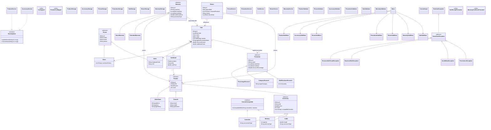

```mermaid
classDiagram
    direction TB

    %% ==========================================
    %% 1. MODEL / DOMAIN LAYER
    %% ==========================================
    class StockUpdater {
        <<interface>>
        +updateStock(String id, int qty)
        +restoreStock(String id, int qty)
    }

    class Product {
        <<abstract>>
        #String id
        #String title
        #double price
        #int stock
    }
    class VideoGame {
        -String platform
        -String genre
        -String ageRating
    }
    class Console {
        -String brand
        -String model
        -String generation
    }

    class ConsoleCompatible {
        <<interface>>
        +isCompatibleWith(String consoleId) boolean
    }

    class Accessory {
        <<abstract>>
        #String id
        #String title
        #double price
        #int stock
        #List~String~ compatibleConsoles
    }
    class Controller {
        -String connectionType
    }
    class Cable {
        -double length
        -String connectorType
    }
    class Memory {
        -int capacity
        -String memoryType
    }

    Product <|-- VideoGame
    Product <|-- Console
    Product <|-- Accessory
    Accessory <|-- Controller
    Accessory <|-- Cable
    Accessory <|-- Memory
    ConsoleCompatible <|.. Controller
    ConsoleCompatible <|.. Memory

    class Person {
        <<abstract>>
        #String id
        #String name
        #String email
        #String phone
    }
    class Client {
        -List~String~ purchaseHistory
    }
    class Seller {
        -String employeeCode
        -String shift
    }

    Person <|-- Client
    Person <|-- Seller

    class Sale {
        -String id
        -LocalDate date
        -Client client
        -Seller seller
        -List~SaleDetail~ details
        -String appliedPromotionName
        -double discountAmount
        -double additionalCosts
    }
    class SaleDetail {
        -Product product
        -int quantity
        -double unitPrice
    }

    Sale "1" *-- "1..*" SaleDetail
    SaleDetail "0..*" --> "1" Product
    Sale "0..*" --> "1" Client
    Sale "0..*" --> "1" Seller

    class Promotion {
        <<abstract>>
        #String id
        #String name
        #LocalDate startDate
        #LocalDate endDate
        #double discountPercentage
    }
    class PercentageDiscount
    class CategoryDiscount {
        -String targetCategory
    }
    class BulkPurchaseDiscount {
        -int minQuantity
    }

    Promotion <|-- PercentageDiscount
    Promotion <|-- CategoryDiscount
    Promotion <|-- BulkPurchaseDiscount
    Sale "0..*" --> "0..1" Promotion : applied promotion

    class Warranty {
        <<abstract>>
        #String id
        #Product product
        #LocalDate startDate
        #LocalDate endDate
        #double additionalCost
        #String warrantyType
    }
    class BasicWarranty
    class ExtendedWarranty

    Warranty <|-- BasicWarranty
    Warranty <|-- ExtendedWarranty
    Warranty "0..*" --> "1" Product : covers
    Warranty "0..*" --> "1" Sale : associated with

    class Return {
        -String id
        -Sale originalSale
        -List~Product~ returnedProducts
        -String reason
        -LocalDate returnDate
    }

    Return "1" --> "1" Sale : references
    Return "1" --> "1..*" Product : returns

    %% ==========================================
    %% 2. PERSISTENCE LAYER
    %% ==========================================
    class CsvSupport {
        <<utility>>
    }
    class ProductCsvMapper {
        <<utility>>
    }
    class ProductStorage
    class AccessoryStorage
    class PersonStorage
    class PromotionStorage
    class SaleStorage
    class ReturnStorage
    class WarrantyStorage

    %% ==========================================
    %% 3. SERVICE LAYER
    %% ==========================================
    class ProductService
    class AccessoryService
    class PersonService
    class PromotionService
    class SaleService
    class ReturnService
    class WarrantyService

    ProductService ..|> StockUpdater
    AccessoryService ..|> StockUpdater

    %% ==========================================
    %% 4. VALIDATION LAYER
    %% ==========================================
    class ProductValidator
    class PersonValidator
    class AccessoryValidator
    class PromotionValidator
    class SaleValidator
    class WarrantyValidator

    %% ==========================================
    %% 5. EXCEPTIONS LAYER
    %% ==========================================
    class RuntimeException
    class GameZoneException {
        <<abstract>>
    }
    class ResourceNotFoundException
    class BusinessRuleException
    class InvalidDataException
    class PersistenceException

    RuntimeException <|-- GameZoneException
    GameZoneException <|-- ResourceNotFoundException
    GameZoneException <|-- BusinessRuleException
    GameZoneException <|-- InvalidDataException
    GameZoneException <|-- PersistenceException

    %% ==========================================
    %% 6. UI & PRESENTATION LAYER
    %% ==========================================
    class ConsoleInput
    class Menu
    class ProductSubMenu
    class AccessorySubMenu
    class PersonSubMenu
    class PromotionSubMenu
    class ReturnSubMenu
    class WarrantySubMenu
    class SaleSubMenu
    class SaleReceiptFormatter {
        <<utility>>
    }
    class WarrantyCertificateFormatter {
        <<utility>>
    }

    Menu --> ProductSubMenu
    Menu --> AccessorySubMenu
    Menu --> PersonSubMenu
    Menu --> PromotionSubMenu
    Menu --> ReturnSubMenu
    Menu --> WarrantySubMenu
    Menu --> SaleSubMenu
```
