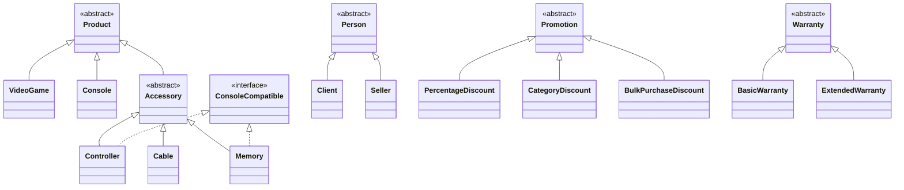

```mermaid
classDiagram
    class Product {
        <<abstract>>
    }
    class VideoGame
    class Console
    class Accessory {
        <<abstract>>
    }
    class Controller
    class Cable
    class Memory
    class ConsoleCompatible {
        <<interface>>
    }
    Product <|-- VideoGame
    Product <|-- Console
    Product <|-- Accessory
    Accessory <|-- Controller
    Accessory <|-- Cable
    Accessory <|-- Memory
    ConsoleCompatible <|.. Controller
    ConsoleCompatible <|.. Memory
 
    class Person {
        <<abstract>>
    }
    class Client
    class Seller
    Person <|-- Client
    Person <|-- Seller
 
    class Promotion {
        <<abstract>>
    }
    class PercentageDiscount
    class CategoryDiscount
    class BulkPurchaseDiscount
    Promotion <|-- PercentageDiscount
    Promotion <|-- CategoryDiscount
    Promotion <|-- BulkPurchaseDiscount
 
    class Warranty {
        <<abstract>>
    }
    class BasicWarranty
    class ExtendedWarranty
    Warranty <|-- BasicWarranty
    Warranty <|-- ExtendedWarranty
```
 