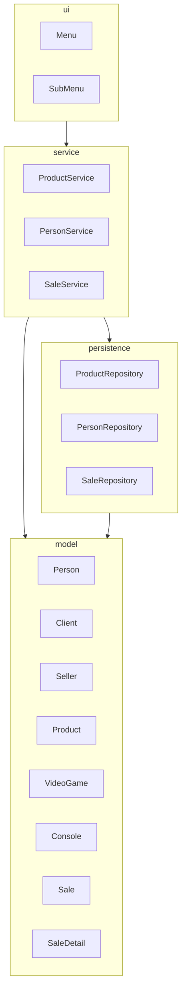

```mermaid
flowchart TD
    subgraph UI["ui"]
        Menu
        SubMenu
    end

    subgraph SERVICE["service"]
        ProductService
        PersonService
        SaleService
    end

    subgraph PERSISTENCE["persistence"]
        ProductRepository
        PersonRepository
        SaleRepository
    end

    subgraph MODEL["model"]
        Person
        Client
        Seller
        Product
        VideoGame
        Console
        Sale
        SaleDetail
    end

    UI --> SERVICE
    SERVICE --> PERSISTENCE
    SERVICE --> MODEL
    PERSISTENCE --> MODEL
```
