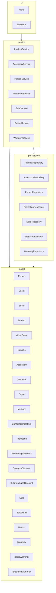

```mermaid
flowchart TD
    subgraph UI["ui"]
        Menu
        SubMenu
    end

    subgraph SERVICE["service"]
        ProductService
        AccessoryService
        PersonService
        PromotionService
        SaleService
        ReturnService
        WarrantyService
    end

    subgraph PERSISTENCE["persistence"]
        ProductRepository
        AccessoryRepository
        PersonRepository
        PromotionRepository
        SaleRepository
        ReturnRepository
        WarrantyRepository
    end

    subgraph MODEL["model"]
        Person
        Client
        Seller
        Product
        VideoGame
        Console
        Accessory
        Controller
        Cable
        Memory
        ConsoleCompatible
        Promotion
        PercentageDiscount
        CategoryDiscount
        BulkPurchaseDiscount
        Sale
        SaleDetail
        Return
        Warranty
        BasicWarranty
        ExtendedWarranty
    end

    UI --> SERVICE
    SERVICE --> PERSISTENCE
    SERVICE --> MODEL
    PERSISTENCE --> MODEL
```