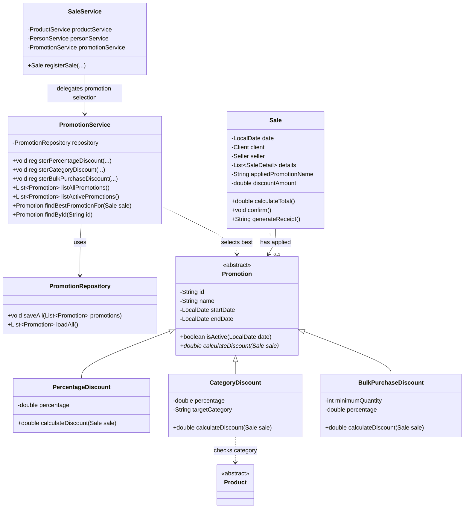

# Class Diagram — Promotion Module

```mermaid
classDiagram
    class Promotion {
        <<abstract>>
        -String id
        -String name
        -LocalDate startDate
        -LocalDate endDate
        +boolean isActive(LocalDate date)
        +double calculateDiscount(Sale sale)*
    }

    class PercentageDiscount {
        -double percentage
        +double calculateDiscount(Sale sale)
    }

    class CategoryDiscount {
        -double percentage
        -String targetCategory
        +double calculateDiscount(Sale sale)
    }

    class BulkPurchaseDiscount {
        -int minimumQuantity
        -double percentage
        +double calculateDiscount(Sale sale)
    }

    class PromotionRepository {
        +void saveAll(List~Promotion~ promotions)
        +List~Promotion~ loadAll()
    }

    class PromotionService {
        -PromotionRepository repository
        +void registerPercentageDiscount(...)
        +void registerCategoryDiscount(...)
        +void registerBulkPurchaseDiscount(...)
        +List~Promotion~ listAllPromotions()
        +List~Promotion~ listActivePromotions()
        +Promotion findBestPromotionFor(Sale sale)
        +Promotion findById(String id)
    }

    class Sale {
        -LocalDate date
        -Client client
        -Seller seller
        -List~SaleDetail~ details
        -String appliedPromotionName
        -double discountAmount
        +double calculateTotal()
        +void confirm()
        +String generateReceipt()
    }

    class SaleService {
        -ProductService productService
        -PersonService personService
        -PromotionService promotionService
        +Sale registerSale(...)
    }

    class Product {
        <<abstract>>
    }

    Promotion <|-- PercentageDiscount
    Promotion <|-- CategoryDiscount
    Promotion <|-- BulkPurchaseDiscount

    PromotionService --> PromotionRepository : uses
    PromotionService ..> Promotion : selects best
    SaleService --> PromotionService : delegates promotion selection
    CategoryDiscount ..> Product : checks category
    Sale "1" --> "0..1" Promotion : has applied
```
