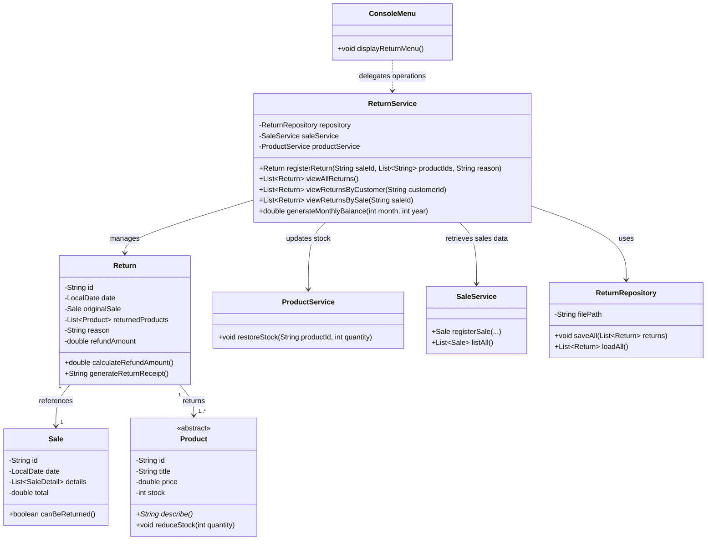

# Return Module Class Diagram

```mermaid
classDiagram
    class Product {
        <<abstract>>
        -String id
        -String title
        -double price
        -int stock
        +String describe()*
        +void reduceStock(int quantity)
    }
    class Sale {
        -String id
        -LocalDate date
        -List~SaleDetail~ details
        -double total
        +boolean canBeReturned()
    }
    class Return {
        -String id
        -LocalDate date
        -Sale originalSale
        -List~Product~ returnedProducts
        -String reason
        -double refundAmount
        +double calculateRefundAmount()
        +String generateReturnReceipt()
    }
    class ProductService {
        +void restoreStock(String productId, int quantity)
    }
    class SaleService {
        +Sale registerSale(...)
        +List~Sale~ listAll()
    }
    class ReturnRepository {
        -String filePath
        +void saveAll(List~Return~ returns)
        +List~Return~ loadAll()
    }
    class ReturnService {
        -ReturnRepository repository
        -SaleService saleService
        -ProductService productService
        +Return registerReturn(String saleId, List~String~ productIds, String reason)
        +List~Return~ viewAllReturns()
        +List~Return~ viewReturnsByCustomer(String customerId)
        +List~Return~ viewReturnsBySale(String saleId)
        +double generateMonthlyBalance(int month, int year)
    }
    class ConsoleMenu {
        +void displayReturnMenu()
    }
    Return "1" --> "1" Sale : references
    Return "1" --> "1..*" Product : returns
    ReturnService --> ReturnRepository : uses
    ReturnService --> SaleService : retrieves sales data
    ReturnService --> ProductService : updates stock
    ReturnService --> Return : manages
    ConsoleMenu ..> ReturnService : delegates operations
```
