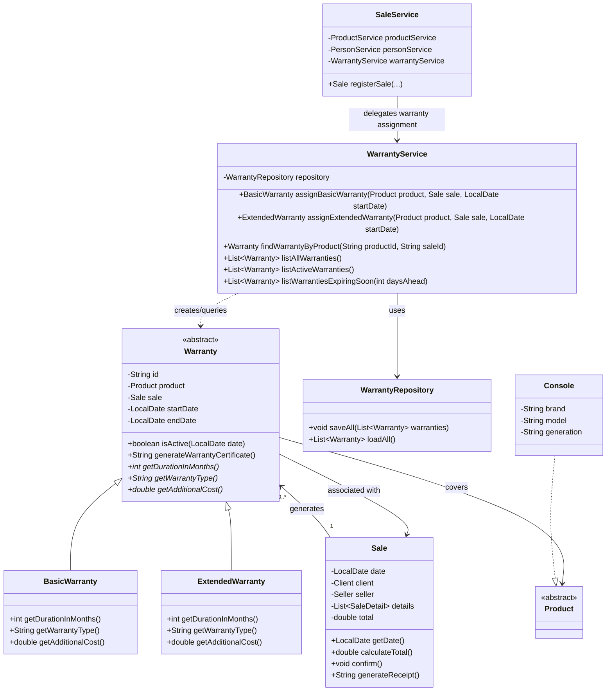

# Class Diagram — Warranty Module

```mermaid
classDiagram
    class Warranty {
        <<abstract>>
        -String id
        -Product product
        -Sale sale
        -LocalDate startDate
        -LocalDate endDate
        +boolean isActive(LocalDate date)
        +String generateWarrantyCertificate()
        +int getDurationInMonths()*
        +String getWarrantyType()*
        +double getAdditionalCost()*
    }

    class BasicWarranty {
        +int getDurationInMonths()
        +String getWarrantyType()
        +double getAdditionalCost()
    }

    class ExtendedWarranty {
        +int getDurationInMonths()
        +String getWarrantyType()
        +double getAdditionalCost()
    }

    class WarrantyRepository {
        +void saveAll(List~Warranty~ warranties)
        +List~Warranty~ loadAll()
    }

    class WarrantyService {
        -WarrantyRepository repository
        +BasicWarranty assignBasicWarranty(Product product, Sale sale, LocalDate startDate)
        +ExtendedWarranty assignExtendedWarranty(Product product, Sale sale, LocalDate startDate)
        +Warranty findWarrantyByProduct(String productId, String saleId)
        +List~Warranty~ listAllWarranties()
        +List~Warranty~ listActiveWarranties()
        +List~Warranty~ listWarrantiesExpiringSoon(int daysAhead)
    }

    class Sale {
        -LocalDate date
        -Client client
        -Seller seller
        -List~SaleDetail~ details
        -double total
        +LocalDate getDate()
        +double calculateTotal()
        +void confirm()
        +String generateReceipt()
    }

    class SaleService {
        -ProductService productService
        -PersonService personService
        -WarrantyService warrantyService
        +Sale registerSale(...)
    }

    class Product {
        <<abstract>>
    }

    class Console {
        -String brand
        -String model
        -String generation
    }

    Warranty <|-- BasicWarranty
    Warranty <|-- ExtendedWarranty

    WarrantyService --> WarrantyRepository : uses
    WarrantyService ..> Warranty : creates/queries
    SaleService --> WarrantyService : delegates warranty assignment
    Warranty --> Product : covers
    Warranty --> Sale : associated with
    Console ..|> Product
    Sale "1" --> "0..*" Warranty : generates
```
